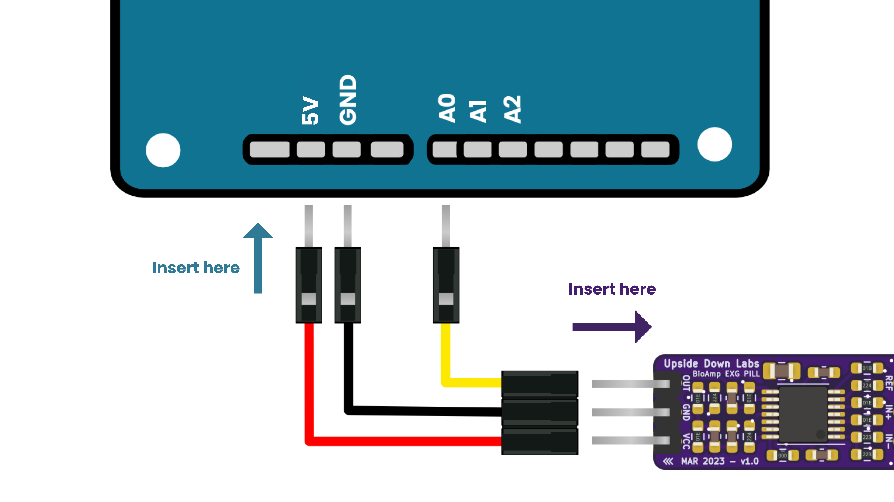
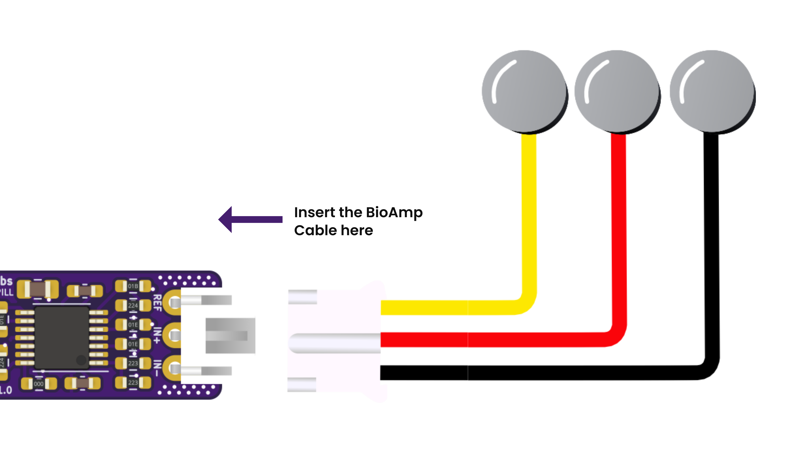
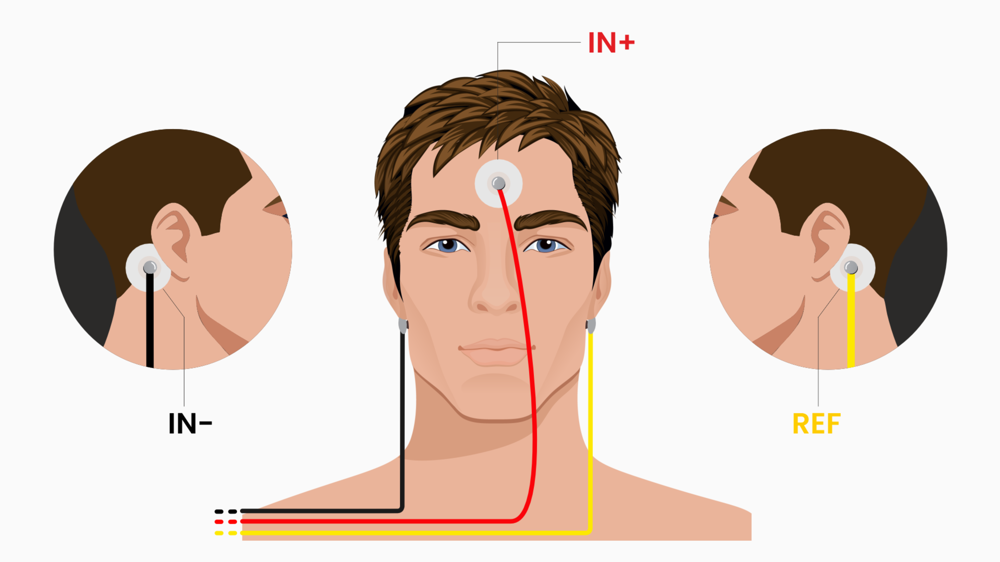

# BCI Gaming

Control games using your brain signals (EEG) and eye blinks (EOG) with Arduino UNO R4 and BioAmp EXG Pill.

For detailed tutorial, head over to our [Instructables](https://www.instructables.com/Playing-Games-With-Your-Mind-Using-Arduino-Uno-R4/)

## How it Works

This project combines EEG and EOG signals from a single channel to control games:

- **Focus (EEG)**: When you concentrate, your brain generates beta waves (13-30 Hz). We detect this to control one key continuously.
- **Double Blink (EOG)**: Two quick blinks trigger a second key press.
- **Triple Blink (EOG)**: Three rapid blinks trigger a third key press.

The Arduino acts as a USB keyboard, sending keypresses to your computer based on these signals.

## Hardware Required

- BioAmp EXG Pill
- BioAmp Cable v3
- 3x Gel Electrodes
- 3x Jumper Cables
- Arduino UNO R4 Minima (or WiFi) with USB Cable
- Nuprep Skin Preparation Gel
- Laptop (do not connect to charger while recording signals)

## Hardware Connections

Connect BioAmp EXG Pill to Arduino UNO R4:
- VCC to 5V
- GND to GND
- OUT to A0

## Electrode Placement

1. Place **IN+** between Fp1 and Fp2 positions on forehead (International 10–20 system).
2. Place **IN-** on the bony part behind the earlobe (one ear).
3. Place **REF** on the bony part behind the earlobe (other ear).

## Upload Instructions

1. Install Arduino IDE and Arduino UNO R4 Boards from Boards Manager.
2. Install CMSIS-DSP library from Library Manager.
3. Download the firmware from Brain BioAmp Arduino Firmware repository.
4. Open `08-bci-gaming.ino` in Arduino IDE.
5. Configure your game keys (default: `w`, `a`, `f`).
6. Select board and COM port, then upload.

## Calibration

If detection isn't working properly:

1. Uncomment `#define DEBUG` to view envelope values.
2. Focus and note maximum beta value, set `BETA_THRESHOLD` to half of this value.
3. Blink and observe maximum EOG envelope value.
4. Set `BLINK_LOWER_THRESHOLD` slightly below and `BLINK_UPPER_THRESHOLD` slightly above this value.

## Controls

| Action           | Required Motion                     | Key Press                     |
|------------------|-------------------------------------|-------------------------------|
| Focus Detection  | Focus your gaze on a single point   | Focus key pressed and held    |
| Double Blink     | Blink two times rapidly             | Double Blink key pressed      |
| Triple Blink     | Blink three times quickly           | Triple Blink key pressed      |

## Important Notes

- Laptop should **not** be connected to the charger (prevents 50/60 Hz interference).
- Maintain ~5 m distance from AC appliances.
- Beta-wave reading dips during blinks due to eye movement artifacts.
