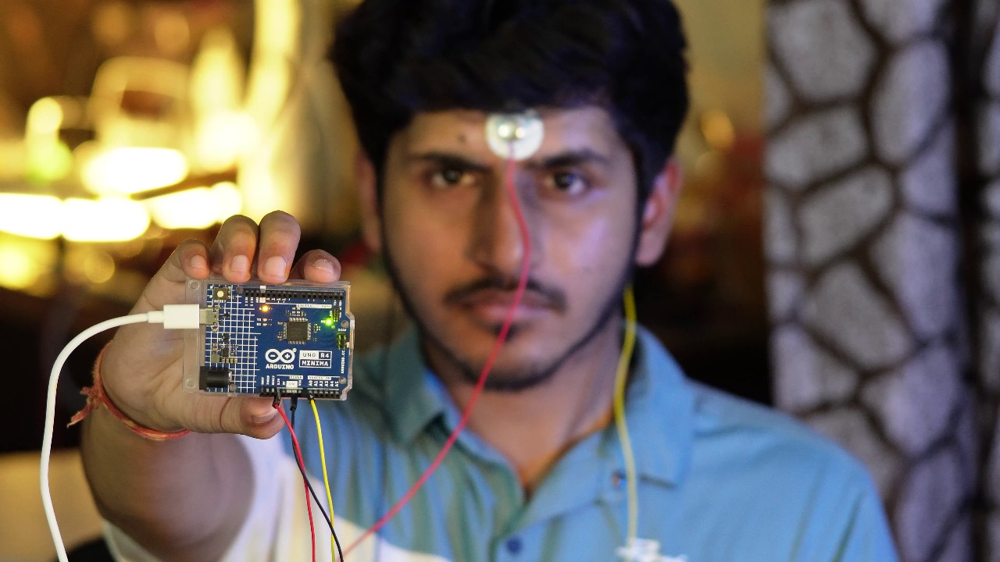
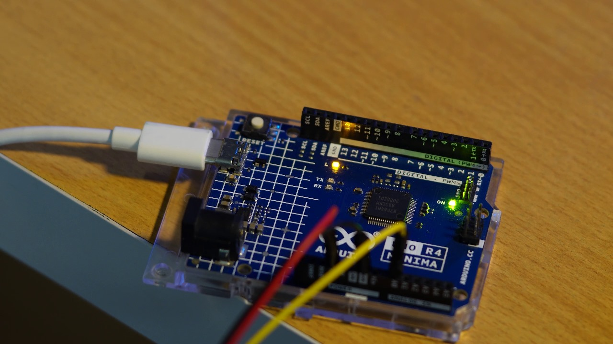

# Brain-BioAmp-Firmware
Firmware for Brain-BioAmp hardware from Upside Down Labs

| No. | Program| Description |
| ---- | ---- | ---- |
|1 | [FixedSampling](01-fixed-sampling)| Sample from ADC at a fixed rate for easy processing of signal.|
|2 | [EEGFilter](02-eeg-filter)| A 0.5 - 29.5 Hz band-pass filter sketch for clean Electroencephalography.|
|3 | [R4BCIFFT](03-bci-fft)| Displays live EEG bandpower on Serial Monitor of Arduino IDE.|
|4 | [R4BCILED](04-bci-led)| Controls an LED based on focus levels. (both R4 Minima and R4 WiFi can be used)|
|5 | [R4BCIToggle](05-bci-toggle)| Toggles the LED on/off using sustained focus for 4 seconds. (both R4 Minima and R4 WiFi can be used)|
|6 | [R4BCISpiral](06-bci-spiral)| Runs the spiral LED game based on focus. (Only R4 WiFi can be used)|
|7 | [1ChEXG](07-1ch-exg)| Multi-modal biosignal demo: detects focus (EEG), blinks (EOG), and jaw clench (EMG). (Arduino R4 Minima and R4 WiFi)
|8 | [BCIGaming](08-bci-gaming)| Controls keyboard input for gaming using focus levels via HID. Presses 'W' key when beta waves exceed threshold. (Arduino R4 Minima and R4 WiFi)

## Examples

1. **Fixed Sampling**

    Samples from ADC at a fixed rate (125 Hz) for easy processing of EEG signals

2. **EEG Filter**

    A band-pass filter for EEG signals between 0,5 Hz and 44.5 Hz 

    

3. **BCI FFT**

    Shows real-time EEG bandpower (Delta, Theta, Alpha, Beta, Gamma) on Arduino Serial Monitor

    

4. **BCI LED**

    Turns an LED on/off using focus (beta waves)

    

5. **BCI Toggle**

    Toggles LED with 4–5 sec focus for brain-controlled switching

    

6. **BCI Spiral Game**

    LED spiral grows with focus, shrinks when distracted—EEG-based game 

    

7. **1-Channel EXG Demo**

    Multi-modal biosignal detection: focus detection (EEG beta waves), blink patterns (EOG), and jaw clenching (EMG) using ARM CMSIS-DSP

8. **BCI Gaming**

    Brain-controlled gaming using HID keyboard emulation. Automatically presses and holds 'W' key when focus levels (beta waves) exceed 10% threshold, enabling hands-free movement control in games. Uses Arduino R4's built-in USB HID functionality for seamless keyboard input.